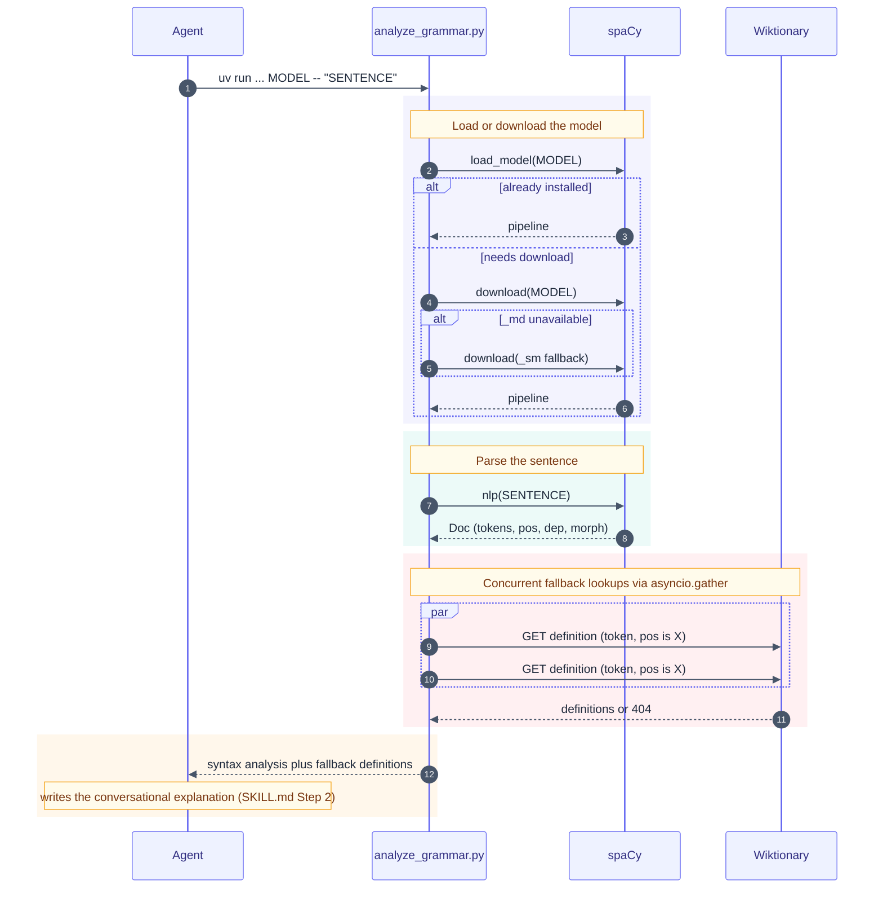

# analyze-grammar-skill

[](https://github.com/nikosavola/analyze-grammar-skill/actions/workflows/test.yml)
[](https://codecov.io/gh/nikosavola/analyze-grammar-skill)
[](https://sonarcloud.io/summary/new_code?id=nikosavola_analyze-grammar-skill)
[](https://github.com/astral-sh/ruff)
[](https://github.com/astral-sh/uv)

An [Agent Skill](https://platform.claude.com/docs/en/agents-and-tools/agent-skills/overview) that grounds grammar
explanations in [spaCy](https://spacy.io/)'s dependency parser instead of an LLM's guesses, with a Wiktionary fallback
for words spaCy can't classify. Works with any language spaCy ships a trained pipeline for.

## Install

```bash
npx skills add nikosavola/analyze-grammar-skill
```

<details>
<summary>Install manually instead</summary>

Clone into your agent's skills directory. The folder name must match the skill's `name` field (`analyze-grammar`):

```bash
git clone https://github.com/nikosavola/analyze-grammar-skill.git ~/.claude/skills/analyze-grammar
```

</details>

## Requirements

- [`uv`](https://docs.astral.sh/uv/) — the script runs via `uv run`, which manages its own dependencies (spaCy, httpx)
  and downloads language models on demand per [PEP 723](https://peps.python.org/pep-0723/).

## How it works

Ask an agent to explain the grammar of a sentence in any language. It picks the matching spaCy
[trained pipeline name](https://spacy.io/models), preferring the `md` size (e.g. `fr_core_news_md`), and runs
`scripts/analyze_grammar.py <spacy_model_name> "<sentence>"`, which parses the sentence with spaCy (downloading the
model on first use, falling back to `sm` if a language has no `md` pipeline) and looks up any word spaCy can't classify
on Wiktionary. The agent uses that output as ground truth for its explanation.

See [SKILL.md](SKILL.md) for the full instructions given to the agent.


